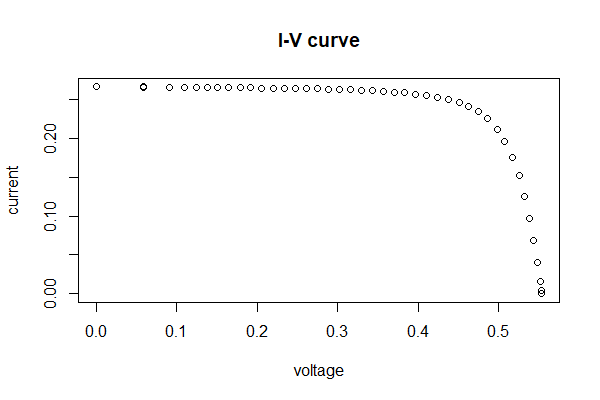

Data Description
-----------------------------------
This dataset comes from SDLE SunFarm, which provides extensive outdoor exposure capabilities, including mini-modules and full size modules mounted on both dual axis trackers fixed racks. 
Modules are individually controlled and operated by Daystar multi-tracer system at their peak power during daylight hours. 
Data acquired include time-series I-V curve data taken every 10 minutes, and time series power, voltage, current and weather data collected every minute.


Load data and run code to extract IV features 
------------------------------------------
```{r, message=FALSE, eval=TRUE}
library(ddiv)
data("IV_daystar")
IVExtractResult(IV_daystar,k=4)
```

Example output
--------------------------
The result for finding steps for example data "IV_daystar", no changepoint identifying step is found.



