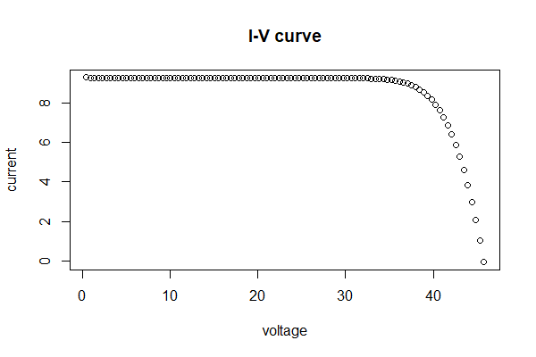
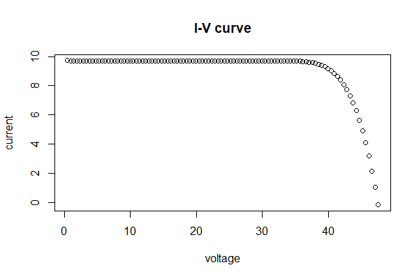

Data Description
-----------------------------------

These 2 IV curves are from an external solar module testing facility. 
2 full sized modules are featured, a standard poly silicon Aluminum Back-Surface Field (AL-BSF) module and a similar sized Passivated Emitter Rear Contact (PERC) mono silicon module. 
The PERC module has a clearly higher power per output per area compared to the Al-BSF module given the higher voltage and current output with a similar fill factor. 

Load data and run code to extract IV features 
------------------------------------------
```{r, message=FALSE, eval=TRUE}
library(ddiv)
data("IV_5M_1")
IVExtractResult(IV_5M_1)

data("IV_5M_2")
IVExtractResult(IV_5M_2)
```

Example output
--------------------------
The result for finding steps for example data "IV_5M_1" and "IV_5M_2", no changepoint identifying step is found.






References
--------------------

Jennifer L. Braid et al., "EL and I-V Correlation for Degradation of PERC vs. Al-BSF Commercial Modules in Accelerated Exposures," presented at the WCPEC-7, Waikoloa, HI, 2018.


